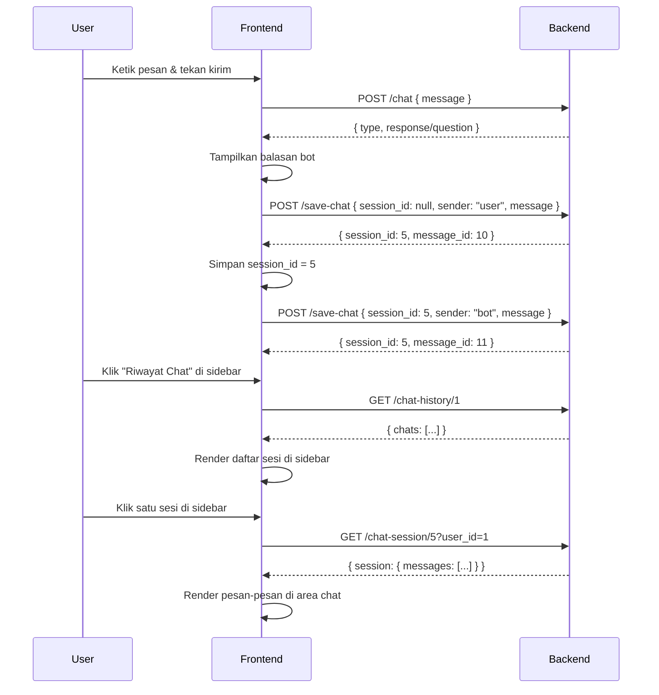

# 📚 Dokumentasi API — Sistem Riwayat Chat BeautyBrain

> **Base URL**: `http://localhost:8000`  
> **Format**: JSON  
> **Auth**: Semua request chat history harus menyertakan `user_id` milik user yang sedang login.

---

## 🗂️ Daftar Endpoint Chat History

| Method | Endpoint | Deskripsi |
|--------|----------|-----------|
| `POST` | `/save-chat` | Simpan satu pesan ke sesi |
| `GET` | `/chat-history/{user_id}` | Ambil semua sesi milik user |
| `GET` | `/chat-session/{session_id}?user_id=` | Ambil detail pesan dalam satu sesi |
| `PUT` | `/chat-session/{session_id}/rename?user_id=` | Rename judul sesi |
| `DELETE` | `/chat-session/{session_id}?user_id=` | Hapus sesi beserta semua pesannya |

---

## 1. POST `/save-chat` — Simpan Pesan

Endpoint ini dipanggil setiap kali ada pesan baru (dari user maupun bot) yang ingin disimpan ke riwayat.

### Alur Kerja
1. Saat **percakapan baru dimulai** → kirim tanpa `session_id`, backend akan membuat sesi baru dan mengembalikan `session_id`.
2. Untuk **pesan berikutnya** dalam sesi yang sama → sertakan `session_id` yang diterima dari respons pertama.

### Request Body

```json
{
  "session_id": null,
  "user_id": 1,
  "sender": "user",
  "message": "Halo, saya ingin konsultasi kulit",
  "title": "Konsultasi 9 Juli 2026"
}
```

| Field | Tipe | Wajib | Keterangan |
|-------|------|-------|------------|
| `session_id` | `int \| null` | Opsional | `null` untuk sesi baru; isi dengan ID sesi yang sudah ada |
| `user_id` | `int` | **Ya** | ID user yang sedang login |
| `sender` | `string` | **Ya** | Nilai: `"user"` atau `"bot"` |
| `message` | `string` | **Ya** | Isi pesan |
| `title` | `string` | Opsional | Judul sesi (hanya dipakai saat membuat sesi baru) |

### Response Sukses `200`

```json
{
  "status": true,
  "session_id": 5,
  "message_id": 12
}
```

> [!IMPORTANT]
> **Simpan `session_id` dari respons pertama** ke state/variable lokal. Gunakan ID ini untuk semua pesan berikutnya dalam percakapan yang sama.

### Contoh Implementasi JavaScript

```javascript
// chatService.js

let currentSessionId = null; // simpan session aktif

async function saveMessage(userId, sender, message) {
  const response = await fetch("http://localhost:8000/save-chat", {
    method: "POST",
    headers: { "Content-Type": "application/json" },
    body: JSON.stringify({
      session_id: currentSessionId,      // null jika sesi baru
      user_id: userId,
      sender: sender,                    // "user" atau "bot"
      message: message,
      title: generateTitle(message)      // judul otomatis dari pesan pertama
    })
  });

  const data = await response.json();

  if (data.status) {
    currentSessionId = data.session_id;  // ⬅️ PENTING: simpan session_id
  }

  return data;
}

function generateTitle(message) {
  // Gunakan 40 karakter pertama sebagai judul
  return message.length > 40 ? message.substring(0, 40) + "..." : message;
}
```

---

## 2. GET `/chat-history/{user_id}` — Daftar Semua Sesi

Mengambil semua sesi percakapan milik user, diurutkan dari terbaru ke terlama.

### URL Parameter

| Parameter | Tipe | Keterangan |
|-----------|------|------------|
| `user_id` | `int` | ID user yang sedang login |

### Response Sukses `200`

```json
{
  "status": true,
  "chats": [
    {
      "id": 5,
      "title": "Konsultasi kulit berminyak",
      "created_at": "2026-07-09T10:30:00",
      "message_count": 8
    },
    {
      "id": 3,
      "title": "Rekomendasi sunscreen",
      "created_at": "2026-07-08T14:20:00",
      "message_count": 4
    }
  ]
}
```

### Contoh Implementasi JavaScript

```javascript
async function loadChatHistory(userId) {
  const response = await fetch(`http://localhost:8000/chat-history/${userId}`);
  const data = await response.json();

  if (data.status) {
    renderSidebar(data.chats); // render ke sidebar
  }
}

function renderSidebar(chats) {
  const sidebar = document.getElementById("chat-history-list");
  sidebar.innerHTML = "";

  chats.forEach(chat => {
    const item = document.createElement("div");
    item.className = "chat-history-item";
    item.dataset.sessionId = chat.id;
    item.innerHTML = `
      <span class="chat-title">${chat.title}</span>
      <span class="chat-meta">${chat.message_count} pesan · ${formatDate(chat.created_at)}</span>
    `;
    item.onclick = () => loadSession(chat.id, userId);
    sidebar.appendChild(item);
  });
}
```

---

## 3. GET `/chat-session/{session_id}?user_id=` — Detail Sesi

Mengambil semua pesan dalam satu sesi secara lengkap, diurutkan dari terlama ke terbaru.

### URL Parameter & Query

| Parameter | Tipe | Keterangan |
|-----------|------|------------|
| `session_id` | `int` (path) | ID sesi yang ingin dibuka |
| `user_id` | `int` (query) | ID user pemilik sesi (untuk validasi) |

### Contoh URL
```
GET http://localhost:8000/chat-session/5?user_id=1
```

### Response Sukses `200`

```json
{
  "status": true,
  "session": {
    "id": 5,
    "title": "Konsultasi kulit berminyak",
    "created_at": "2026-07-09T10:30:00",
    "messages": [
      {
        "id": 10,
        "sender": "user",
        "text": "Halo, saya ingin konsultasi kulit",
        "created_at": "2026-07-09T10:30:00"
      },
      {
        "id": 11,
        "sender": "bot",
        "text": "Baik, saya akan membantu menganalisis kondisi kulit Anda.",
        "created_at": "2026-07-09T10:30:05"
      }
    ]
  }
}
```

### Contoh Implementasi JavaScript

```javascript
async function loadSession(sessionId, userId) {
  const response = await fetch(
    `http://localhost:8000/chat-session/${sessionId}?user_id=${userId}`
  );
  const data = await response.json();

  if (data.status) {
    currentSessionId = data.session.id; // aktifkan sesi ini
    renderMessages(data.session.messages);
  }
}

function renderMessages(messages) {
  const chatContainer = document.getElementById("chat-messages");
  chatContainer.innerHTML = "";

  messages.forEach(msg => {
    const bubble = document.createElement("div");
    bubble.className = `message-bubble ${msg.sender === "user" ? "user" : "bot"}`;
    bubble.textContent = msg.text;
    chatContainer.appendChild(bubble);
  });

  chatContainer.scrollTop = chatContainer.scrollHeight;
}
```

---

## 4. PUT `/chat-session/{session_id}/rename?user_id=` — Rename Sesi

Mengubah judul sesi percakapan.

### URL Parameter & Query

| Parameter | Tipe | Keterangan |
|-----------|------|------------|
| `session_id` | `int` (path) | ID sesi yang akan diubah |
| `user_id` | `int` (query) | ID user pemilik sesi |

### Request Body

```json
{
  "title": "Judul Baru Sesi"
}
```

### Response Sukses `200`

```json
{
  "status": true,
  "message": "Judul sesi berhasil diperbarui.",
  "session_id": 5,
  "new_title": "Judul Baru Sesi"
}
```

### Contoh Implementasi JavaScript

```javascript
async function renameSession(sessionId, userId, newTitle) {
  const response = await fetch(
    `http://localhost:8000/chat-session/${sessionId}/rename?user_id=${userId}`,
    {
      method: "PUT",
      headers: { "Content-Type": "application/json" },
      body: JSON.stringify({ title: newTitle })
    }
  );

  const data = await response.json();

  if (data.status) {
    // Update judul di sidebar UI
    document.querySelector(`[data-session-id="${sessionId}"] .chat-title`)
      .textContent = data.new_title;
  }
}
```

---

## 5. DELETE `/chat-session/{session_id}?user_id=` — Hapus Sesi

Menghapus sesi beserta semua pesan di dalamnya secara permanen.

### URL Parameter & Query

| Parameter | Tipe | Keterangan |
|-----------|------|------------|
| `session_id` | `int` (path) | ID sesi yang akan dihapus |
| `user_id` | `int` (query) | ID user pemilik sesi |

### Response Sukses `200`

```json
{
  "status": true,
  "message": "Sesi berhasil dihapus."
}
```

### Contoh Implementasi JavaScript

```javascript
async function deleteSession(sessionId, userId) {
  const confirmed = confirm("Yakin ingin menghapus percakapan ini?");
  if (!confirmed) return;

  const response = await fetch(
    `http://localhost:8000/chat-session/${sessionId}?user_id=${userId}`,
    { method: "DELETE" }
  );

  const data = await response.json();

  if (data.status) {
    // Hapus item dari sidebar
    document.querySelector(`[data-session-id="${sessionId}"]`).remove();

    // Jika sesi yang dihapus adalah sesi aktif, bersihkan chat
    if (currentSessionId === sessionId) {
      currentSessionId = null;
      clearChatArea();
    }
  }
}
```

---

## ⚙️ Penanganan Error

Semua endpoint mengembalikan HTTP error code standar:

| HTTP Code | Artinya | Contoh Kasus |
|-----------|---------|--------------|
| `400` | Bad Request | Data tidak valid |
| `404` | Not Found | User/sesi tidak ditemukan |
| `422` | Validation Error | Field wajib tidak diisi |
| `500` | Server Error | Kesalahan internal server |

### Contoh Response Error

```json
{
  "detail": "Sesi tidak ditemukan."
}
```

### Penanganan Error di Frontend

```javascript
async function apiCall(url, options = {}) {
  try {
    const response = await fetch(url, {
      headers: { "Content-Type": "application/json" },
      ...options
    });

    const data = await response.json();

    if (!response.ok) {
      throw new Error(data.detail || "Terjadi kesalahan pada server.");
    }

    return data;

  } catch (error) {
    console.error("API Error:", error.message);
    showNotification(error.message, "error"); // tampilkan ke user
    return null;
  }
}
```

---

## 🔄 Alur Lengkap: Integrasi Chat + Riwayat



---

## 💾 Contoh State Management (React/Vanilla JS)

```javascript
// chatState.js — State management sederhana

const ChatState = {
  userId: null,          // diisi saat login
  currentSessionId: null, // sesi yang sedang aktif
  sessions: [],          // daftar semua sesi dari /chat-history

  // Set user setelah login
  setUser(user) {
    this.userId = user.id;
  },

  // Mulai sesi baru
  startNewSession() {
    this.currentSessionId = null;
  },

  // Simpan session_id setelah save-chat pertama
  setSession(sessionId) {
    this.currentSessionId = sessionId;
  },

  // Load semua sesi
  async loadSessions() {
    const data = await apiCall(`/chat-history/${this.userId}`);
    if (data) this.sessions = data.chats;
  }
};
```

---

## 📝 Catatan Implementasi

> [!TIP]
> **Judul Otomatis**: Gunakan 5 kata pertama dari pesan user pertama sebagai judul sesi.  
> Contoh: `"Saya ingin rekomendasi sunscreen"` → judul: `"Saya ingin rekomendasi sunscreen"`

> [!NOTE]
> **localStorage**: Simpan `user_id` dan `session_id` aktif di `localStorage` agar tidak hilang saat halaman di-refresh.

> [!WARNING]
> **Hapus session_id** dari state ketika user menekan tombol "New Chat" agar pesan berikutnya membuat sesi baru.
